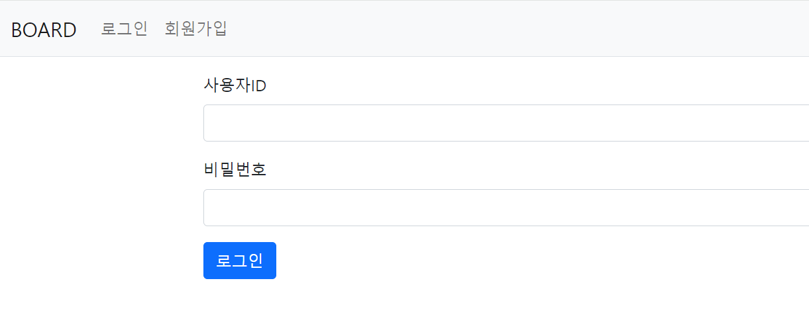
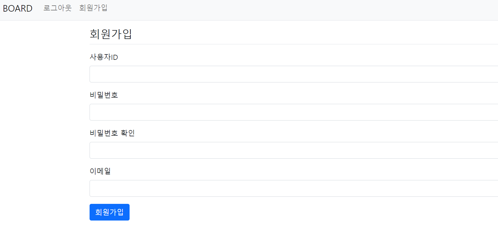
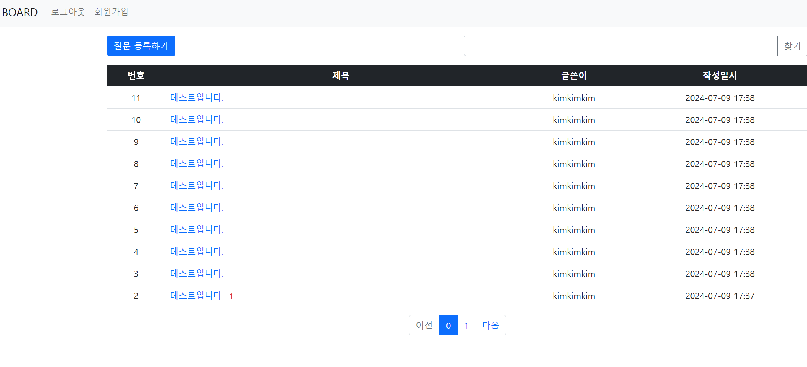
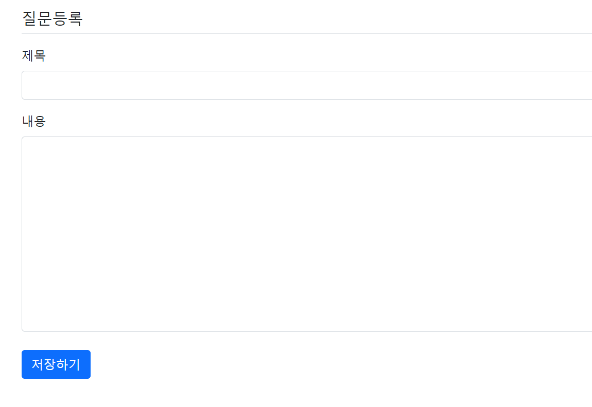
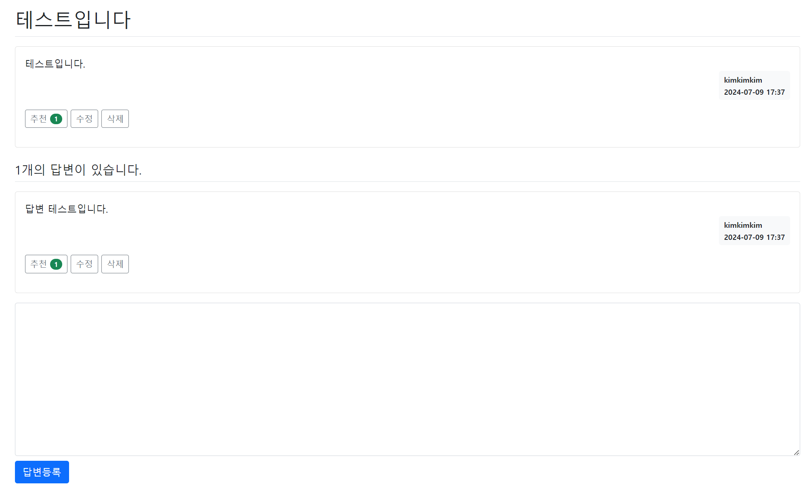

# 게시판 프로젝트
## 개요
Spring Boot를 활용한 게시판 제작

## 주요 기능
- **회원 관리**: 회원 가입, 로그인, 로그아웃
- **질문**: 질문 등록, 질문 수정, 질문 삭제
- **답변**: 질문에 답변 등록 기능, 추천 기능

## 기술 스택
- **백엔드**: Spring Boot, Spring Data JPA, Hibernate
- **프론트엔드**: Thymeleaf, HTML, CSS, JavaScript, JQuery
- **데이터베이스**: MySQL
- **빌드 도구**: Gradle

## 사용 방법
- **회원 가입 및 로그인**:
1. 홈페이지 상단의 "회원가입" 버튼을 클릭하여 회원 가입을 완료합니다.
2. "로그인" 버튼을 클릭하여 로그인합니다.

- **질문 등록**:
1. "질문 등록하기"를 버튼을 클릭하여 질문을 등록할 수 있습니다.

- **답변 등록**:
1. 게시판 목록의 질문에 답변을 등록할 수 있다.

## 스크린샷
- **로그인 화면**

- **회원가입**

- **게시판 목록**

- **질문 등록**

- **답변**

